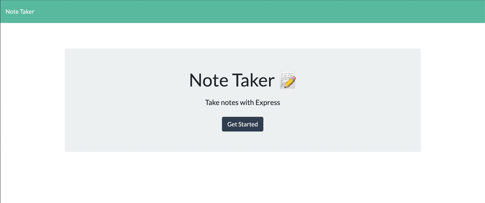
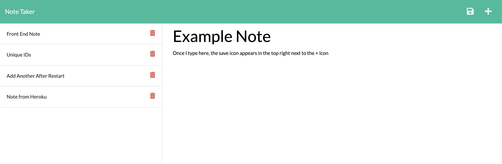

# Express Note Taker

## Description
An application that allows users to enter, save, and delete notes. Uses Express.js to process GET, POST, and DELETE requests.

## Use
- WHEN I open Express Note Taker, I am presented with a landing page with a link to a notes page
- WHEN I click on the link to the notes page, I am presented with a page with existing notes listed in the left-hand column, plus empty fields to enter a new note title and the note’s text in the right-hand column
- WHEN I enter a new note title and the note’s text, a Save icon appears in the navigation at the top of the page
- WHEN I click on the Save icon, the new note I have entered is saved and appears in the left-hand column with the other existing notes
- WHEN I click on an existing note in the list in the left-hand column, that note appears in the right-hand column
- When I click on the trash can icon next to an existing note, the note is deleted
- WHEN I click on the + icon in the navigation at the top right of the page, I am presented with empty fields to enter a new note title and the note’s text in the right-hand column

## Layout

## Link
[Deployed App - Heroku](https://lexlo-express-notes.herokuapp.com/)
